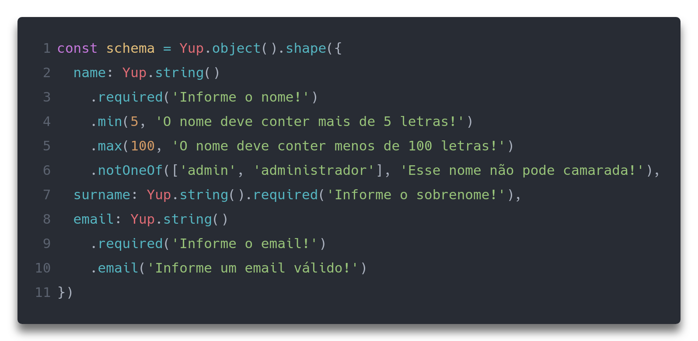

 on [Unsplash](https://unsplash.com?utm_source=medium&utm_medium=referral)](./asset-1)

> Acompanhe a série completa!

> P[arte 1 — Construa formulários em React, sem lágrimas.](https://medium.com/reactbrasil/formik-construa-formul%C3%A1rios-em-react-sem-l%C3%A1grimas-a80c52887882)

> [Parte 2 — Melhorando formulários em React com libs de componentes](https://medium.com/reactbrasil/formik-parte-2-melhorando-formul%C3%A1rios-em-react-com-libs-de-componentes-d2a29d3045d)

> [**Veja a nova API do Formik com hooks!**](https://medium.com/reactbrasil/formik-com-hooks-simplicidade-e-pot%E1%BB%81ncia-useformik-parte-1-d518fec52dae)

Eae! Nessa parte 3, iremos falar de validações, como você já deve bem ter percebido. Em meus poucos anos de experiência com validações de formulários, seja ela em qualquer linguagem, sempre foi uma solução verbosa e repetitiva. Foi assim que (infelizmente) eu aprendi, pelos lugares que passei.

Contudo, quando decidi procurar uma ferramenta para melhorar a construção de _forms_ em React (eu vinha do Vue, onde graças ao _twoway data binding_, as coisas eram mais fáceis, portanto queria isso para minha vida com React também), primeiramente comecei a mexer com [Redux Forms](https://redux-form.com/8.1.0/) e pra ser sincero, não lembro como valida os formulários. Voltando à procura, achei o [Formik](https://github.com/jaredpalmer/formik) e logo de cara, já fiquei extasiado com a simplicidade e o poder que ele proporcionava! Quando fui para a parte de validações nativas, a felicidade se manteve alta, pois era uma função bem bacana, que casava diretamente com um [componente de exibição de erro](https://jaredpalmer.com/formik/docs/api/errormessage) (tipo aqueles textos que ficam embaixo do _input_). Foi um sucesso.

De volta a documentação para destrincha-la, descobri que no Formik foi criado uma integração especialmente com o [Yup](https://github.com/jquense/yup), ferramenta de _Object schema validation_. Então, depois de alguns exemplos e de entender o espirito da coisa, fui aplicar e … PORRA! Vi que era 10x, 20x mais poderosa que a validação nativa do Formik, que já era boa! Então, de lá pra cá, não deixo de usar mais!

Primeiramente, vou mostrar a parte nativa e posteriormente, a integração com o Yup e seus benefícios.

O Yup também vale para React Native!

PS: Vamos usar a mesma validação — uma simples e uma mais complexa — para ambos os casos, afim de comparação!

PS2: No final do artigo tem um codesandbox para você brincar :)

> _Well, talk is cheap show me the code!_

---

### Validação nativa — simples

-   As validações começam na linha 9 e são bem simples. apenas se estão preenchidas ou não.

---

### Validação nativa — um pouco mais complexa

-   As coisas começam a ficar mais cabulosas / verbosas

---

### Agora, vamos ao que interessa!

> Por algum motivo que não sei qual, a doc pede para importar o Yup assim: `import * as Yup from “yup”`

Ao utilizar o Yup, deixaremos de invocar a prop `validate` do `withFormik`e usaremos a `validationSchema.`

-   Obrigatoriamente criamos a estrutura `Yup.object().shape({ ... })`;
-   A chave do `object` deve ser o mesmo nome do `values` usado no `mapPropsToValues` como demostrados nas linhas 7, 8 e 9.

---

### Validação com Yup — simples

-   Schema em JSON, simples e declarativo!

### Validação com Yup — um pouco mais complexa

-   Agora sim, começa a ficar interessante!
-   Basicamente, os métodos seguem o padrão: Primeiro parâmetro é o valor e o segundo é a mensagem de erro
-   Existe uma [infinidade de métodos](https://github.com/jquense/yup#api) prontos e que com certeza vão te atender!

Com isso, em ambos os casos, basta chamar o [componente de erro](https://jaredpalmer.com/formik/docs/api/errormessage), utilizando a prop `name`e pronto!

Você pode customizar o componente de `[ErrorMessage](https://jaredpalmer.com/formik/docs/api/errormessage)`:

### E o resultado final, das validações:

### Tem até validação com condicional a lá if / else !

-   Se `isBig` for verdadeiro, então o valor mínimo de `count` será 5, caso contrário, será 0.

[Aqui você consegue dar uma olhada nos exemplos e na API do Yup](https://github.com/jquense/yup#usage)

Acho que por ora é isso, obrigado por ler :)

Aqui você pode brincar com o código:

### Valeu!